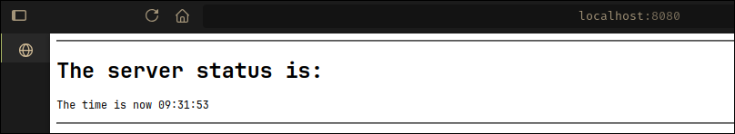

<div align="center">
    <h1 align="center">Basic Websocket</h1>
    <p align="center">
Hosts a simple WebSocket server demonstrating basic WebSocket connectivity by periodically broadcasting the current time to connected clients.
    </p>
</div>

</br>

## 🚀 Key Features

- Basic WebSocket Server: Core implementation of a WebSocket server.
- Live Time Updates: Periodically sends server time to all connected clients.
- Connectivity Demo: Illustrates how clients connect, receive data, and maintain persistent connections.

### 🛠️ Technologies Used

- Backend: Java WebSockets

</br>
</br>

## 🏗️ Architecture and Design Patterns

This project employs a Publisher-Subscriber communication pattern via WebSockets. The server acts as the publisher of the current time, while clients subscribe to these updates, receiving messages in real-time. This simple design clarifies connection handling and message broadcasting.

</br>
</br>

## 📦 Installation and Execution

- Clone the repository:

```sh
git clone https://github.com/Andr3xDev/ARSW-Websocket.git
cd ARSW-Websocket
```

- Install dependencies:

```sh
mvn clean verify
mvn spring-boot:run
```

The server will listen on ws://localhost:8080.

</br>
</br>

## 📊 Usage and Demonstration

Once the server is running, open a web browser on localhost with port 8080.


